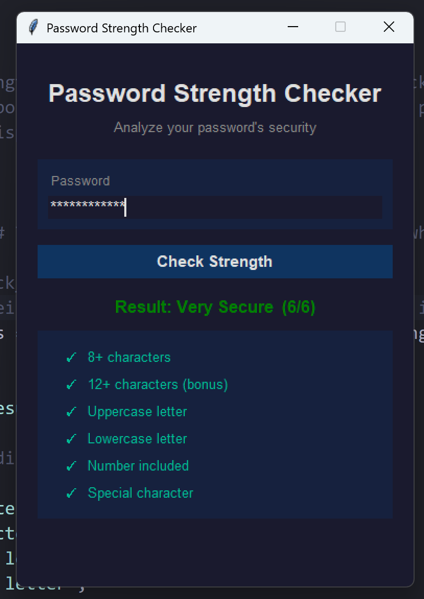

# 🔐 Password Strength Checker

A Python desktop application that analyzes password strength in real time using regex pattern matching and security best practices.

Built as part of my cybersecurity learning journey as a first-year CIS student at Cal Poly Pomona.

---

## 📸 Screenshot



---

## ✨ Features

- Real-time password strength analysis scored from 0 to 6
- Checks for uppercase letters, lowercase letters, numbers, and special characters
- Bonus scoring for passwords that are 12+ characters long
- Blocklist check against the most common passwords based on NordPass
- Dark mode desktop GUI built with Tkinter
- Color-coded checklist showing exactly which requirements passed and which failed
- Secure password input — characters are hidden while typing

---

## 🛠️ Technologies Used

- **Python 3** — Core programming language
- **Tkinter** — Built-in Python library for the desktop GUI
- **re (Regex)** — Pattern matching for password rule validation
- **getpass** — Secure CLI password input (removed after GUI was implemented)

---

## 🚀 How to Run

1. Make sure Python 3 is installed on your machine
2. Clone this repository:
```
   git clone https://github.com/z76hxtzzms-cmyk/password-strength-checker.git
```
3. Navigate into the project folder:
```
   cd password-strength-checker
```
4. Run the GUI application:
```
   python password_strength_checker_gui.py
```
5. Or run the command line version:
```
   python password_strength_checker.py
```

> No external libraries required — everything uses Python's standard library!

---

## 📁 Project Structure
```
password-strength-checker/
│── password_strength_checker.py      # Core logic — strength analysis engine
│── password_strength_checker_gui.py  # Tkinter GUI — dark mode desktop app
│── README.md
│── screenshot.png
```

---

## 🧠 What I Learned

- Strengthened my understanding of **regex** for real-world pattern matching use cases
- Built my first **desktop GUI** using Python's built-in Tkinter library
- Learned how to use **Python dictionaries** to pass structured data between functions — coming from Java, these are similar to HashMaps
- Learned why **common password blocklists** are used in real security systems
- Applied **modular imports** to connect multiple Python files together
- Practiced **separation of concerns** by keeping core logic and UI in separate files

---

## 🔮 Future Improvements

- [ ] Add a password generator that creates a random strong password automatically
- [ ] Add a show/hide password toggle button
- [ ] Expand the common passwords blocklist
- [ ] Add more advanced strength measurement (entropy scoring)
- [ ] Package as a standalone .exe using PyInstaller

---

## 🤖 AI Assistance

This project was built with guidance from Claude (Anthropic) as part of a mentored learning experience. The majority of the code — especially `password_strength_checker.py` — was written by me. AI was used to help debug, clean up code, assist with Tkinter UI layout, and help with the overall project architecture to ensure a clean connection between the UI and core logic.

---

## ⚠️ Disclaimer

This tool is intended for **educational purposes only**. It does not store, transmit, or log any passwords entered by the user.