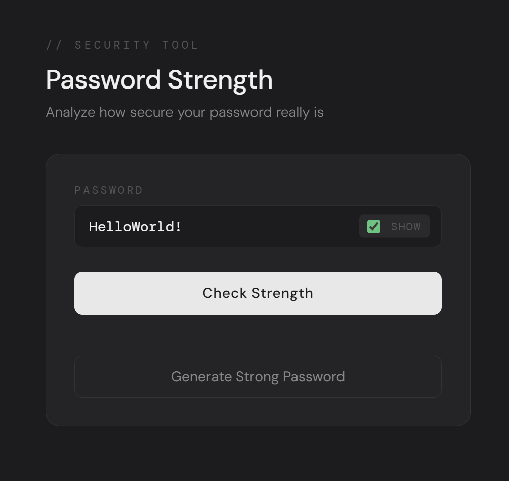
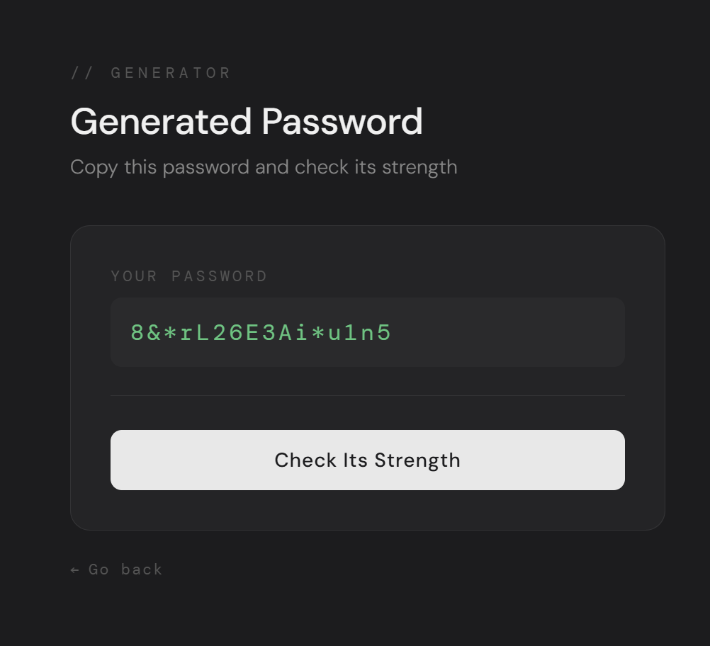
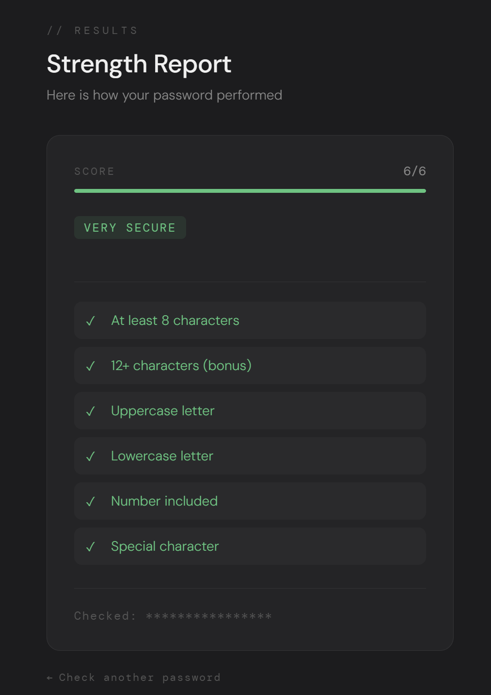

# Password Strength Checker

A Python web application that analyzes password strength in real time using 
regex pattern matching and security best practices. Also includes a built-in 
secure password generator.

Built as part of my cybersecurity learning journey as a first-year CIS student 
at Cal Poly Pomona. I do not trust other password checkers, so I decided to 
build my own.

---

## Screenshots

**Homepage**


**Password Generator**


**Results**


---

## Features

- Real-time password strength analysis scored from 0 to 6
- Checks for uppercase letters, lowercase letters, numbers, and special characters
- Bonus scoring for passwords that are 12+ characters long
- Blocklist check against the most common passwords based on NordPass
- Built-in secure password generator that guarantees all character requirements are met
- Show/hide password toggle to prevent mistyping
- Color-coded checklist showing exactly which requirements passed and which failed
- Visual strength bar that fills based on password score
- Soft dark gray web UI built with Flask

---

## Technologies Used

- **Python 3** — Core programming language
- **Flask** — Python web framework for routing and serving pages
- **Jinja2** — Templating engine for passing Python data to HTML
- **HTML** — Form structure and page layout
- **CSS** — Custom soft dark gray UI styling with Google Fonts
- **re (Regex)** — Pattern matching for password rule validation
- **random** — Python standard library used for secure password generation

---

## How It Works

1. User enters a password or generates one using the built-in generator
2. The HTML form sends the password to Flask via a POST request
3. Flask passes it to `check_strength()` in `password_strength_checker.py`
4. The function checks the password against 6 rules using regex and returns a score, rating, color, and results dictionary
5. Flask passes all values to `results.html` via Jinja2 templating
6. The results page displays a strength bar, rating badge, and a checklist showing which rules passed and failed

**Password Generator Flow:**
1. User clicks Generate Strong Password
2. Flask calls `generatePassword()` which guarantees at least one uppercase, lowercase, number, and special character
3. Remaining characters are filled randomly from a combined character pool
4. The list is shuffled to ensure unpredictable ordering
5. Generated password is displayed and can be sent directly to the strength checker

---

## How to Run

1. Make sure Python 3 is installed on your machine
2. Install Flask:
```
   pip install flask
```
3. Clone this repository:
```
   git clone https://github.com/z76hxtzzms-cmyk/password-strength-checker.git
```
4. Navigate into the project folder:
```
   cd password-strength-checker
```
5. Run the Flask app:
```
   python app.py
```
6. Open your browser and go to:
```
   http://127.0.0.1:5000
```
7. Or run the command line version directly:
```
   python password_strength_checker.py
```

---

## Project Structure
```
password-strength-checker/
│── password_strength_checker.py   # Core logic — strength analysis and password generator
│── app.py                         # Flask web server and route handling
│── templates/
│   │── index.html                 # Password input form with show/hide toggle
│   │── results.html               # Strength results with score bar and checklist
│   │── generate.html              # Generated password display page
│── static/
│   │── style.css                  # Soft dark gray UI styling
│── README.md
│── screenshots/
│   │── s1.png                     # Homepage
│   │── s2.png                     # Password generator
│   │── s3.png                     # Results page
```

---

## What I Learned

- Strengthened my understanding of **regex** for real-world pattern matching use cases
- Learned how to use **Python dictionaries** to pass structured data between functions — coming from Java, these are similar to HashMaps
- Learned why **common password blocklists** are used in real security systems based on NIST guidelines
- Applied **modular imports** to connect multiple Python files together
- Practiced **separation of concerns** by keeping core logic and UI in separate files
- Built a **Flask web application** with multiple routes handling both GET and POST requests
- Learned **Jinja2 templating** — passing Python variables and running logic directly inside HTML
- Understood the difference between **GET and POST** requests and when to use each
- Built a **password generator** using Python's random library with guaranteed character variety and shuffle randomness
- Learned why **show/hide password toggles** matter from a UX and security perspective — a mistyped password gives a false sense of security

---

## Future Improvements

- [x] Add a password generator
- [x] Add a show/hide password toggle
- [x] Build a Flask web interface
- [ ] Expand the common passwords blocklist
- [ ] Add entropy scoring for more advanced strength measurement
- [ ] Add copy to clipboard button on the generator page
- [ ] Deploy publicly using Railway or Render

---

## AI Assistance

All of the code in `password_strength_checker.py` was written entirely by me,
with the core logic built from prior knowledge of Python and regex. AI was used
to help debug, clean up code, and assist with bug fixes in the Flask
implementation. AI had a significant role in creating the UI — I built the
barebones HTML structure while AI built upon it to create a more professional
look and feel for the application.

---

## Disclaimer

This tool is intended for educational purposes only. It does not store, 
transmit, or log any passwords entered by the user.